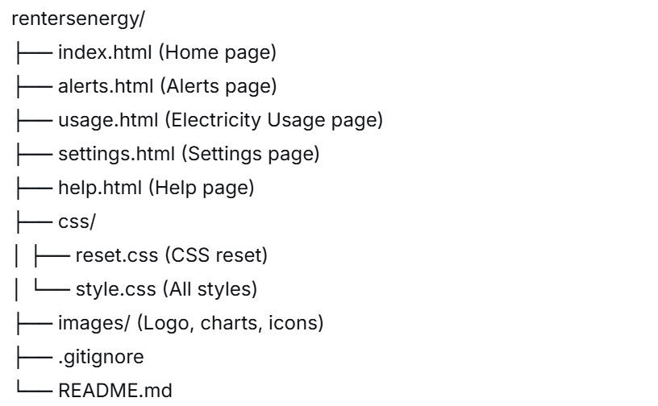

# RentersEnergy

## A user-friendly electricity management tool for Queensland renters

---

## Project Overview

RentersEnergy is a responsive website designed to help renters understand and manage their electricity costs. Many renters struggle with unclear bills, reactive management, and feeling excluded from homeowner-focused programs. Our solution provides:

- Clear visual breakdowns of electricity usage
- Proactive alerts for abnormal consumption
- Renter-specific energy saving tips
- Easy appliance configuration
- Government support program information

---

## Team OL1 – 2008ICT Design Thinking in IT

| Name            | Role                      |
| --------------- | ------------------------- |
| Yuehui Chen     | Team Lead, Home page, CSS |
| Thomas Benfer   | Alerts page               |
| Jack Carrall    | Usage page, Pitch script  |
| Kane Bebb       | Settings page             |
| David Acworth   | Help page                 |
| Ashley Burgoyne | Pitch video recording     |

---

## Tech Stack

- **HTML5** – Semantic structure
- **CSS3** – Flexbox, Grid, Variables, Media Queries
- **No JavaScript** – Static prototype (hard-coded mock data)
- **No backend** – All data is mock for demonstration

---

## Features

### 5 Screens

| Screen                      | Description                                                 |
| --------------------------- | ----------------------------------------------------------- |
| **Home**              | Dashboard with alerts, usage chart, government support card |
| **Alerts**            | Master-detail layout, bulk actions, notification settings   |
| **Electricity Usage** | Appliance and room breakdown, period selector               |
| **Settings**          | Profile, property, and appliance configuration              |
| **Help**              | FAQ, contact options, live chat mock                        |

### Design Highlights

- **Mobile-first responsive design** – Bottom navigation on mobile, top nav on desktop
- **Colourblind-friendly palette** – Blue and amber tones (no red-green)
- **Accessibility** – WCAG contrast, keyboard focus outlines, alt text on images
- **CSS animations** – Pulsing NEW badge, button hover effects

---

## How to Run

1. Download the ZIP file
2. Extract all files to a folder
3. Open `index.html` in a web browser
4. No server or installation required

---

## File Structure

---

## Colour Palette

| Colour             | Hex     | Usage                           |
| ------------------ | ------- | ------------------------------- |
| Primary (Teal)     | #4A9B7A | Headers, main nav, save buttons |
| Secondary (Blue)   | #0474cc | Edit, Add New, dropdown buttons |
| Warning (Amber)    | #D97706 | Warnings, high usage alerts     |
| Delete (Burgundy)  | #97233F | Delete account, cancel          |
| Highlight (Yellow) | #FFF3B0 | Unread alert background         |

### Chart Palette (Electricity-themed)

| Usage Level | Colour        | Hex     |
| ----------- | ------------- | ------- |
| Low         | Power Green   | #32CD32 |
| Medium      | Electric Blue | #00BFFF |
| High        | Surge Orange  | #FF8C00 |
| Critical    | Voltage Red   | #FF4444 |

---

## Security Considerations

### Current Prototype

- Limited free-text input (minimal attack surface)
- Confirmation dialogs for destructive actions
- Only necessary data collection (no sensitive personal data)

### Production Future

- HTTPS with TLS 1.3
- Backend authentication (JWT in HTTP-only cookies)
- Encrypted database storage
- Input sanitisation and validation
- Rate limiting on login attempts

---

## Testing

The website was tested using:

- **Cognitive walkthrough** with other student teams
- **Mobile-first testing** (Chrome DevTools device emulation)
- **Cross-browser testing** (Chrome, Firefox, Edge)
- **Accessibility checks** (keyboard navigation, contrast)

---

## Credits

- Icons: Emoji and Unicode symbols
- Colour palette: Custom, based on WCAG accessibility guidelines
- Font: System default (system-ui) for performance

---

## Submission

- **Due date:** Friday Week 12
- **Course:** 2008ICT Design Thinking in IT
- **Institution:** Griffith University

---

© 2026 Team OL1 – RentersEnergy
